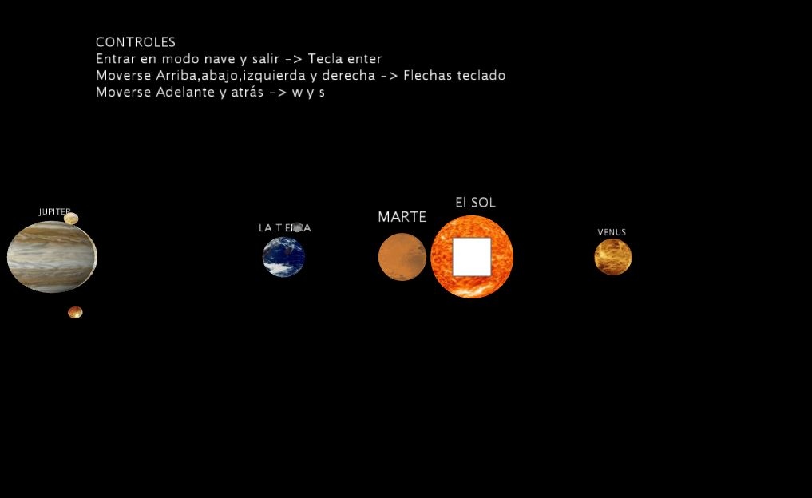
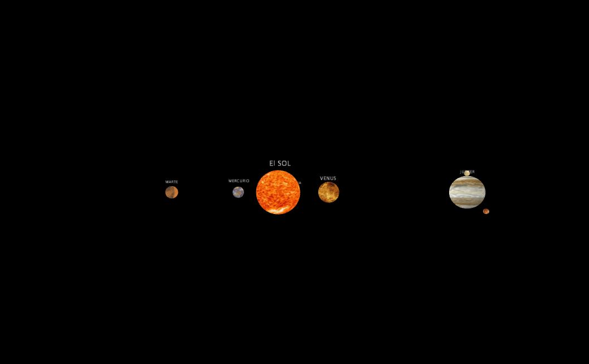
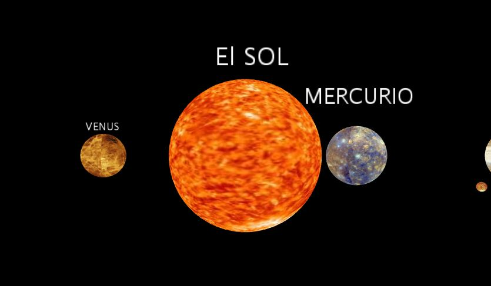
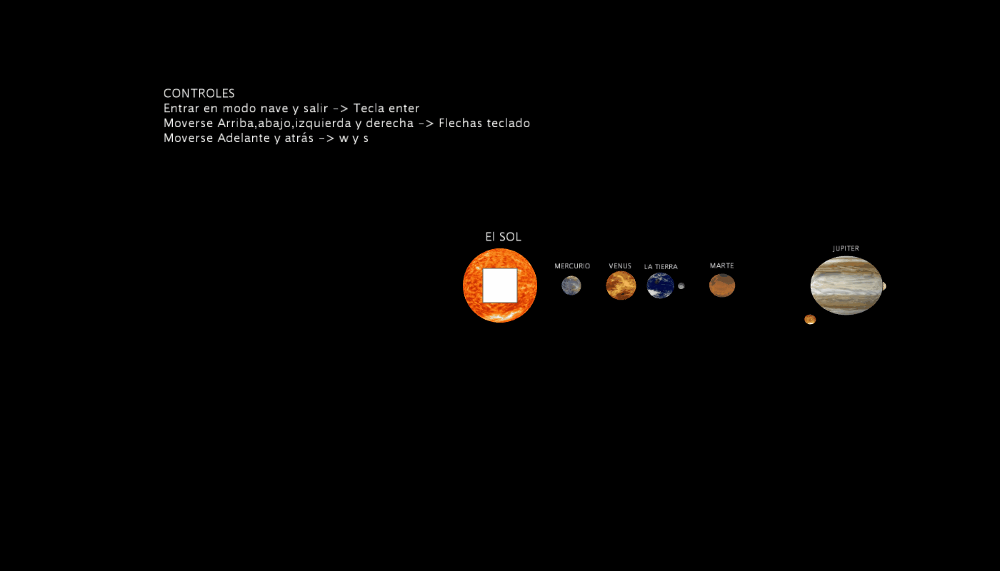

# Solar_system_spaceship
Navegación a traves de un sistema solar con figuras 3D y texturas utilizando imágenes.
<!-- PROJECT LOGO -->
 

  <h3 align="center">Navegación a travéS del sistema solar</h3>

  

    ¡Navega a través del Sistema Solar!
     
      <a href="https://github.com/carlosepb/solar_system_spaceship/blob/main/images/animation.gif"><strong>Explorar repositorio»</strong></a>
     
     
      <a href="https://github.com/carlosepb/Solar_system/blob/main/images/animationSol.gif">Ver Demo</a>
      ·
      <a href="https://github.com/carlosepb/solar_system_spaceship/issues">Reportar Error</a>
      ·
      <a href="https://github.com/carlosepb/solar_system_spaceship/issues">Solicitar Colaboración</a>
    

  

<!-- TABLE OF CONTENTS -->

  
Tabla de Contenido

  <ol>
    <li>
      <a href="#sobre-el-proyecto">Sobre el Proyecto</a>
      <ul>
        <li><a href="#herramientas-de-desarrollo">Herramientas de Desarrollo</a></li>
      </ul>
    </li>
    <li><a href="#trabajo-realizado">Trabajo Realizado</a></li>
    <li>
      <a href="#empezando">Empezando</a>
      <ul>
        <li><a href="#prerrequisitos">Prerrequisitos</a></li>
        <li><a href="#instalación">Instalación</a></li>
        <li><a href="#ejecutar">Ejecutar</a></li>
      </ul>
    </li>
    <li><a href="#hoja-de-ruta">Hoja de Ruta</a></li>
    <li><a href="#licencia">Licencia</a></li>
    <li><a href="#contacto">Contacto</a></li>
    <li><a href="#agradecimientos">Agradecimientos</a></li>
  </ol>

<!-- ABOUT THE PROJECT -->
## Sobre el Proyecto

En la primera pantalla se nos presentarán las instrucciones de como entrar y salir del modo cámara libre, además de los controles de movimiento. también podemos ver los planetas orbitar alrededor del sol con sus respectivos nombres y rotaciones sobre si mismos. Se ha limitado la zona de desplazamiento para evitar alejarnos demasiado del sistema solar o superar la coordenada 0 del eje z.(imagen_1.0)

 imagen_1.0

Una vez entremos en el modo cámara libre podremos desplazarnos libremente a través del sistema solar utilizando las teclas de flechas para subir, bajar, ir izquierda e ir derecha, además de w y s para avanzar y retroceder. En la imagen inferior podemos ver como podemos alejarnos.(imagen_2.0)

 imagen_2.0

En la imagen inferior podemos ver como también podemos acercarnos a los distintos planetas además de la estrella. Al desplazarnos la nave no lo hace modificando directamente su posición si no que aumenta gradual mente su velocidad según el tiempo que se tenga una de las teclas de desplazamiento pulsada hasta una velocidad máxima e igualmente ira perdiendo velocidad gradualmente una vez soltemos la tecla.(imagen_3.0)

 imagen_3.0

Por último podemos ver como cambiamos del modo vista normal al modo cámara dinámica y desplazarnos por el sistema solar y volver al modo normal que resetea el estado de la cámara.(imagen_4.0)

 imagen_4.0

## Trabajo Realizado

Para el movimiento de la cámara se usa la función camera() la cual varia de estática a móvil dependiendo de una variable booleana que controla en que estado de funcionamiento se encuentra en ese momento, haciendo uso del evento keypressed() y keyreleased() para realizar los cambios de estado.

Se ha decidido mantener la rotación y orbita de los planetas activa durante el movimiento de la cámara para permitir ver las diferentes partes de los planetas y la estrella ya que de otra manera la parte posterior siempre estaría oculta.

El sistema de aceleración y frenado se a diseñado de manera que al mantener una tecla pulsada una variable de tipo float aumente gradualmente su valor hasta un máximo en cada iteración de la función draw().

## Herramientas de Desarrollo

* [Processing3](https://processing.org/download/)

<!-- GETTING STARTED -->
## Empezando

Para modificar la aplicación necesitará instalar el entorno de desarrollo Processing3. En caso de que solo quiera ejecutar la versión release no será necesario que instale nada y puede pasar directamente al paso Ejecutar->Release.

### Prerrequisitos

* Descargar y descomprimir Processing3, lo puedes encontrar [aquí](https://processing.org/download/).

### Instalación
1. Para exportar a un archivo con formato gif animado es necesario instalar GifAnimation, lo puede encontrar [aquí](https://github.com/extrapixel/gif-animation).
   
### Ejecutar

1. Release.
    * Descomprimir rar.
    * Entrar a la versión correspondiente a nuestro windows.
    * Lanzar sistema_solar_spaceship.exe
2. Proyecto.
    * Descomprimir rar.
    * Ejecutar Processin3.
    * Archivo->Abrir...

<!-- ROADMAP -->
## Hoja de Ruta

En este momento no hay planes de mejorar la aplicación.

<!-- LICENSE -->
## Licencia

Software completamente libre para copiar o distribuir.

<!-- CONTACT -->
## Contacto

Autor: Carlos Eduardo Pacichana Bastidas

Email: carlos.eduardo.pacichana@gmail.com  carlos.pacichana101@alu.ulpgc.es

Enlace al proyecto: [https://github.com/carlosepb/solar_system_spaceship](https://github.com/carlosepb/solar_system_spaceship)

<!-- ACKNOWLEDGEMENTS -->
## Agradecimientos
* [Processing](https://processing.org/)
* [Gif-animation](https://github.com/extrapixel/gif-animation)
* [Funprogramming](https://funprogramming.org/)
* [Text](https://processing.org/reference/text_.html)
* [Texturas](https://pixabay.com/es/images/search/planeta/)
